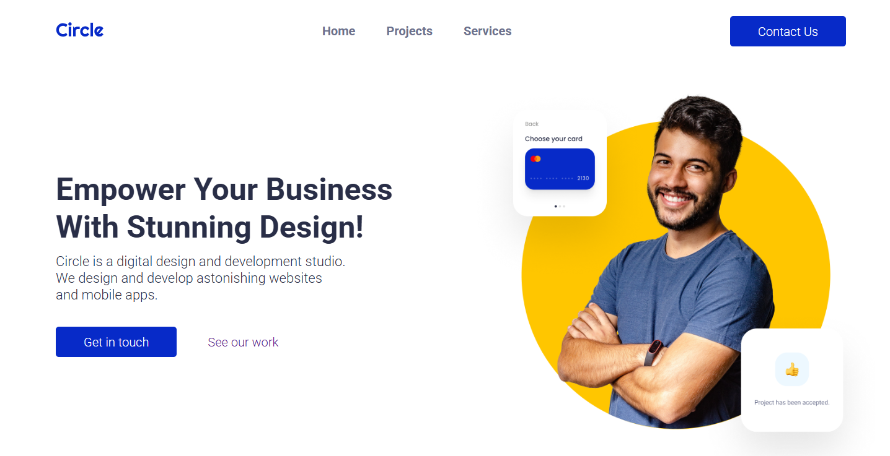

# Circle – Digital Design & Development Studio



## 🌐 Descripción

**Circle** es una landing page moderna para un estudio digital de diseño y desarrollo web. El objetivo principal es mostrar una presencia visual fuerte y profesional, destacando los servicios, proyectos recientes y generando confianza con un diseño limpio y llamativo.

https://thriving-pie-ea2c17.netlify.app/ 

---

## 🛠️ Stack Tecnológico

- **HTML5** – Estructura semántica del contenido
- **CSS3** – Estilos personalizados y responsive design
- **JavaScript** – Funcionalidades interactivas como el menú hamburguesa
- **Google Fonts** – Tipografías modernas (Roboto y Roboto Condensed)
- **Font Awesome** – Iconos para enriquecer el contenido visual

---

## ✨ Funcionalidades Implementadas

- ✅ Menú de navegación responsivo con botón hamburguesa
- ✅ Hero section con imagen destacada y llamada a la acción
- ✅ Sección de proyectos con cards y enlaces a detalles individuales
- ✅ Página de contacto accesible desde el header
- ✅ Diseño completamente responsive para móvil y escritorio
- ✅ Uso de variables CSS para mantener consistencia de color
- ✅ Scroll suave entre secciones ancla

---

## 📁 Estructura de páginas

| Página | Descripción |
|--------|-------------|
| `/index.html` | Página principal con hero, proyectos y servicios |
| `/pages/projects.html` | Página con detalles de un proyecto específico |
| `/pages/contact.html` | Formulario de contacto o información para contactar |
| `/css/` | Carpeta de hojas de estilo (`global.css`, `index.css`, `projects.css`, `contact.css`) |
| `/js/` | Archivos JavaScript (`global.js`, `index.js`, `projects.js`, `contact.js`) |
| `/images/` | Recursos visuales como logos, mockups, fondos y avatares |

---

## 🚀 Cómo clonar y correr el proyecto

1. Clona este repositorio:
```bash
git clone https://github.com/vctorhernandez/ironhack-project-part1
